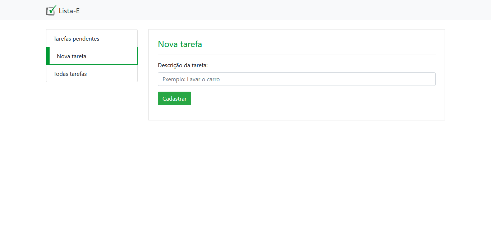
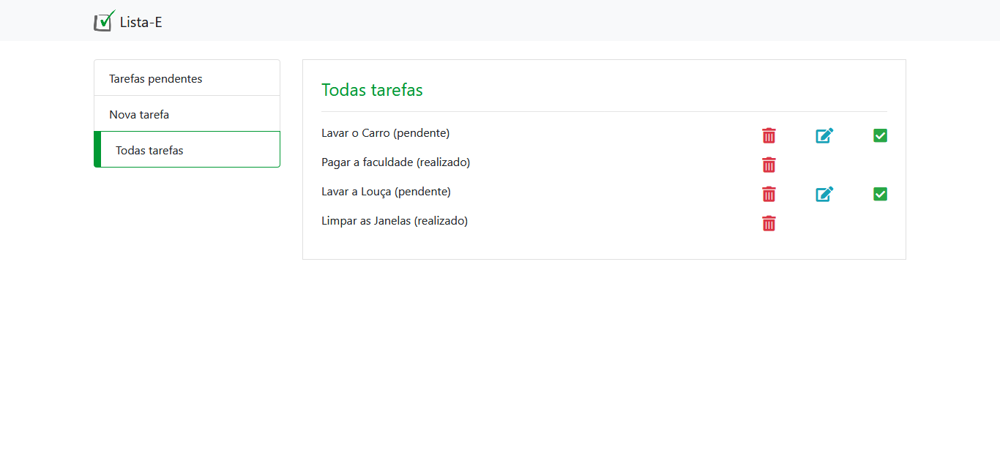

# Lista-E #

Lista-E é um sistema de anotações de tarefas para serem feitas, sendo no fundo um CRUD

<strong>Em breve, link para testar:</strong> ???

## Techs Utilizadas ##
	- HTML 5
	- CSS 3
	- BootStrap 4
  - PHP 7(POO) + PDO
	- MySQL(phpmyadmin)

## Feito ##

- [X] Cadastrar Tarefas.
- [X] Deletar Tarefas.
- [X] Atualizar Tarefas.
- [X] Marcar Tarefa Feita
- [X] Visualizar Todas as Tarefas ou só a Pendentes

## Como rodar o App ##

	-Primeiro:
		- É preciso importar o arquivo Actions/lista-e.sql no seu Banco de Dados Mysql(De preferência pelo phpmyadmin);
	-Segundo:
		- Configurar o Acesso da aplicação com o Banco de Dados, no arquivo Actions/Connection.php;
	-Terceiro:
		- Ligar servidor do Xampp ou Wampp, acessar o localhost:80 no seu navegador e pronto.

## Telas ##

### Cadastrar Tarefas ###

### Ver todas as Tarefas ###

### Tarefas Pendentes ###

